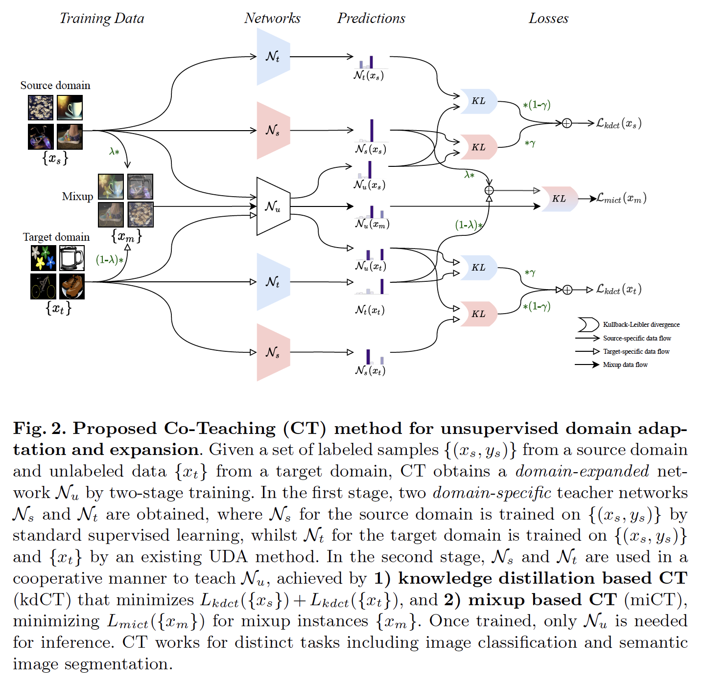

# Co-Teaching for Unsupervised Domain Adaptation and Expansion

Co-Teaching (CT)is a generic method for unsupervised domain adaptation and expansion. CT consists of knowledge distillation based CT (kdCT) and mixup based CT (miCT). Specifically, kdCT transfers knowledge from a leader-teacher network and an assistant-teacher network to a student network, to let the student better resolve cross-domain visual ambiguity, while miCT further enhances the generalization ability of the student. CT works for both image classification and image semantic segmentation. 

<center></center>


## Prepare the Environment
Python version is 3.8.
```
pip install -r requirements.txt
```
## Download Data

First, we need download [Office-Home](https://www.hemanthdv.org/officeHomeDataset.html) and [DomainNet](http://ai.bu.edu/M3SDA/) into `datasets` folder.
Our data division follows the [KDDE](https://arxiv.org/abs/2104.00233). Download division data lists and pretrained checkpoints in this [Google Drive link](https://drive.google.com/file/d/14CEO3qHDr_0LBZoRVjq1BNXlDCTl3pvX/view) into `VisualSearch`.


## Inference with Pre-Trained Models

We provide the command to inference model and predict one task.

```
python  predict.py  --config="configs/CT_DDC_ResNet50.yaml" --source="Art" --target="Clipart"  --dataset="officehome" --datasetroot="datasets/OfficeHome" --num_class=65 --run=1
```

We also provide the script to predict all tasks in one dataset (Office-Home or DomainNet).
```
bash predict.sh
```

## Train New Models

We provide four different **yaml** files in `configs`，which can be used to configure the KDDE and CT. Changing different yaml files to train different models.

We provide the command to train one task.
```
python  train.py  --config="configs/CT_DDC_ResNet50.yaml" --source="Art" --target="Clipart"  --dataset="officehome" --datasetroot="datasets/OfficeHome" --num_class=65 --run=2
```
We also provide the script to train all tasts in one dataset (Office-Home or DomainNet).

```
bash train.sh
```

## Evaluate Model Performance
### Models

* ResNet50: Trained exclusively on the source domain.
* DDC: A classical deep domain adaptation model that minimizes domain discrepancy measured in light of first-order statistics of the deep features (Tzeng et al., Deep Domain Confusion: Maximizing for Domain Invariance, ArXiv 2014)
* SRDC: A deep domain adaptation model that enhances its discrimination ability by clustering features from intermediate
layers of the network.
* [KDDE](https://dl.acm.org/doi/abs/10.1145/3448108): The first generic method for unsupervised domain adaptation and expansion.
* **Co-Teaching**: Our  method for unsupervised domain adaptation and expansion by alleviating cross-domain visual ambiguity.


### Office-Home

```
python eval_all_tasks.py --test_collection officehome_test
```

| Model      | Source domains | Target domains | Expanded domains |
|------------|---------------:|---------------:|-----------------:|
| ResNet50   |         82.44 |         56.85 |           69.64 |
| DDC        |         82.20 |         60.34 |           71.27 |
| SRDC       |         78.64 |         66.35 |           72.50 |
| KDDE(DDC)  |         82.57 |         61.62 |           72.10 |
| KDDE(SRDC) |         81.50 |         67.20 |           74.35 |
| CT(DDC)    |         **82.98** |         63.11 |           73.05 |
| CT(SRDC)   |         82.38 |         **67.32** |           **74.85** |


### DomainNet

```
python eval_all_tasks.py --test_collection domainnet_test
```

| Model      | Source domains | Target domains | Expanded domains |
|------------|---------------:|---------------:|-----------------:|
| ResNet50   |         74.59 |         41.49 |           58.04 |
| DDC        |         72.44 |         46.20 |           59.32 |
| KDDE(DDC)  |         73.77 |         48.04 |           60.91 |
| CT(DDC)    |         **74.63** |         **48.42** |           **61.53** |

## License
This project is released under the Apache License. Please see the [LICENSE](LICENSE) file for more information.


